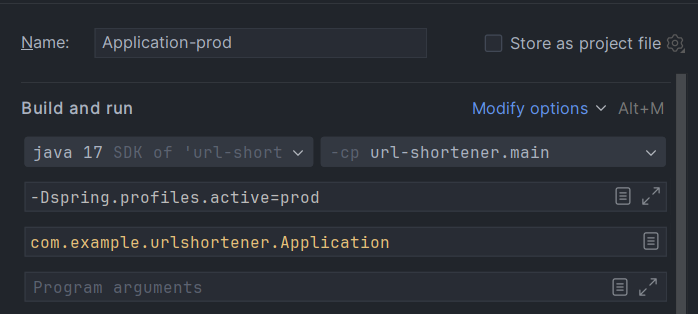

# URL Shortener
## Tool to shorten URLs and generate short links
### URL shortener allows to create a shortened link making it easy to share

>### Run the application
> The application has two profiles for launch: default and prod. 
>+ Default: to run the program with the default profile, there is no need to do anything. 
>+ Prod: to run the program with the prod profile, you need to rename the .env.example file to .env and assign valid data to the keys in this file. 
>  
>  DB_URL is the URL for connecting to the database. 
>  
>  DB_USERNAME is the username for the database. 
>
>  DB_PASSWORD is the database password. 
>  
>  Also, add a VM launch parameter -Dspring.profiles.active=prod as shown at image below.
>  
> 